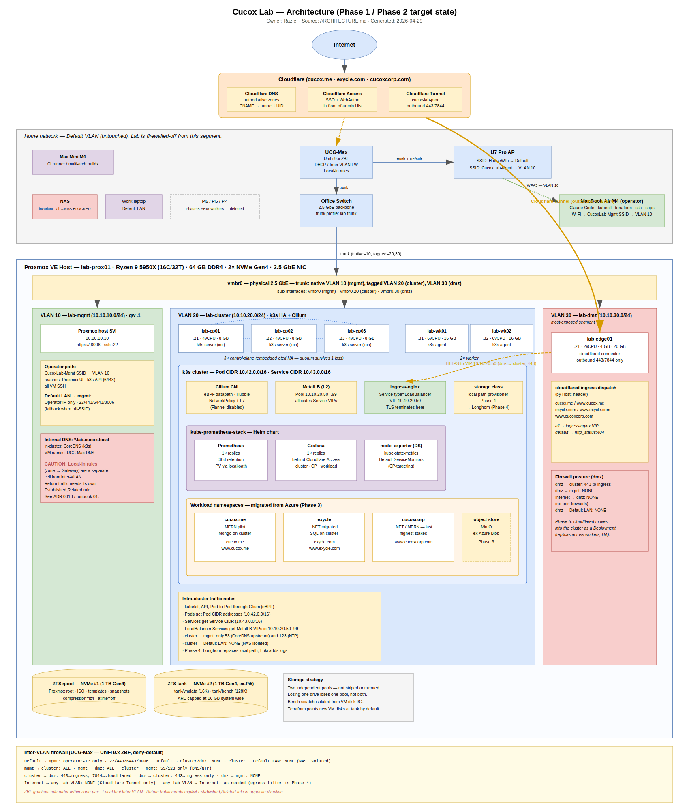

# Cucox Lab — Architecture

> **Status:** Draft · Phase 1 (VM bringup + k3s cluster, in progress)
> **Last updated:** 2026-04-29
> **Owner:** Raziel

This is the canonical design document for the Cucox Lab. It is intentionally
opinionated and rationale-heavy: every decision should be traceable to a goal,
and every goal should be visible from this document.

---

## 0. Architecture at a glance

The diagram below is a single-page rendering of the Phase 1 / Phase 2 target
state described in §§ 1–10. It is the orientation map: every box has a
corresponding section in this document, and every line on the diagram is
either a physical link, a logical traffic flow, or a control-plane
relationship that some section explains and constrains.



**How to read it.** Top-to-bottom is roughly outside → inside: Internet →
Cloudflare (DNS / Access / Tunnel) → UCG-Max + Office Switch + U7 Pro AP →
Proxmox host (one big container) → three VLAN swimlanes inside the host
(mgmt / cluster / dmz) → ZFS pools at the bottom. The orange line is the
only path Internet traffic takes into the lab — Cloudflare Tunnel out to
`lab-edge01`, then HTTPS into the cluster ingress VIP. The footer
summarizes the inter-VLAN firewall matrix from § 3.3.

**Files.**

- Editable source: [`docs/diagrams/cucox-lab-architecture.drawio`](./docs/diagrams/cucox-lab-architecture.drawio)
  — open in [draw.io desktop](https://github.com/jgraph/drawio-desktop) or
  [diagrams.net](https://app.diagrams.net).
- Rendered SVG (embedded above): [`docs/diagrams/cucox-lab-architecture.svg`](./docs/diagrams/cucox-lab-architecture.svg).
- Diagram conventions and planned future diagrams: [`docs/diagrams/README.md`](./docs/diagrams/README.md).

When you change any of the architecture below, update the diagram in the same
commit. The `.drawio` is source-of-truth; re-export the SVG to the same path
before committing so the two never drift. ADRs that materially change the
diagram (new VLAN, new edge component, change to firewall posture, etc.)
should call that out in the ADR's "Diagram impact" line.

---

## 1. Goals

The lab exists to serve two intertwined objectives:

1. **Run real workloads off-cloud.** Migrate three to four production web
   applications (.NET + MERN, Azure SQL + Mongo Atlas + Azure Blob) from Azure
   to a self-hosted cluster, with low operational burden and minimal external
   dependencies.
2. **Be a learning platform for senior-level systems engineering.** Provide a
   realistic environment for applying *Designing Data-Intensive Applications*,
   ByteByteGo system-design patterns, and HPC-adjacent perf work — including
   building custom distributed primitives (a message broker, cache, etc.) in
   Go/C and benchmarking them against canonical implementations.

Non-goals (Phase 1):

- Five-nines availability. This is a single-site lab. We design for graceful
  degradation, not for survivable disasters.
- Multi-tenant security. One operator (Raziel). Threat model is "keep house
  network safe from lab; keep internet from reaching lab except via the
  Tunnel".
- Cost optimization vs. the cloud. The lab will likely cost more in
  electricity-amortized terms than Azure. The value is learning and control.

---

## 2. Hardware

### 2.1 Phase 1 — Ryzen workstation (active)

| Component | Spec |
|---|---|
| CPU | AMD Ryzen 9 5950X (16C/32T, Zen 3, AM4) |
| RAM | 64 GB DDR4 |
| Storage | 2× 1 TB NVMe SSD (Gen 4 M.2) — second drive relocated from Pi5 |
| NIC | 2.5 GbE PCIe |
| Role | Single bare-metal hypervisor host (Proxmox VE) |

This is the entire compute footprint for Phases 1–4. A 5950X with 64 GB is
ample for a 5-VM k3s HA cluster, observability stack, and several application
workloads with headroom for benchmarking. The two NVMes form independent ZFS
pools (`rpool` for system + ISOs, `tank` for VM data + benchmark scratch) —
see § 4.2. Rationale for the relocation: the Pi5 NVMe HAT is PCIe Gen 2 x1
(~500 MB/s ceiling), so a Gen 4 NVMe is wasted there; in the Ryzen on a Gen 4
M.2 slot it runs at full ~7 GB/s.

### 2.2 Phase 5 — ARM expansion (deferred)

| Device | Spec | Planned role |
|---|---|---|
| Raspberry Pi 5 | 16 GB RAM, microSD or small NVMe (1 TB relocated to Ryzen) | k3s ARM worker (`lab-arm01`) |
| Raspberry Pi 5 | 8 GB RAM, 512 GB NVMe | k3s ARM worker (`lab-arm02`) |
| Raspberry Pi 4 | 8 GB RAM, 256 GB SSD | Edge / observability ingest |
| Mac Mini M4 | 16 GB RAM, 256 GB NVMe | Multi-arch image build (`docker buildx`), local CI runner |

The Pis enter the cluster as ARM workers in Phase 5 to give the platform a
genuinely heterogeneous workload-scheduling surface (taints/tolerations, node
affinity, multi-arch images). The Mac Mini stays out of the cluster — macOS is
not a good k8s node host — but earns its keep building multi-arch images.

### 2.3 Operator workstation

| Device | Spec | Role |
|---|---|---|
| MacBook Air M4 | 16 GB RAM | Primary operator machine. Runs Claude Code, kubectl, terraform CLI, ssh, sops. |

The Mac Air stays on Wi-Fi for now. In Phase 5, when broker benchmarking
demands jitter-free measurement, optionally wire it to the Office Switch via
a USB-C 2.5 GbE adapter.

---

## 3. Network

### 3.1 Topology

```
Internet
   │
[UCG-Max]                            ← VLANs, DHCP, inter-VLAN firewall
   │ (trunk: untagged Default + tagged 10/20/30)
[Office Switch]
   │
   ├── port:work-laptop ──── Default LAN (untouched)
   ├── port:nas ──────────── Default LAN (untouched, firewalled off from lab)
   ├── port:pi-01..03 ────── Default LAN (deferred to Phase 5)
   └── port:ryzen ────────── Trunk: native=mgmt(10), tagged=cluster(20)+dmz(30)
                                │
                          [Proxmox vmbr0]
                                ├── vmbr0    → mgmt   (host + mgmt-VLAN VMs)
                                ├── vmbr0.20 → cluster (k3s nodes)
                                └── vmbr0.30 → dmz    (cloudflared, ingress)

[U7 Pro AP] (trunked from UCG-Max)
   ├── SSID: HouseWiFi          → Default LAN (existing)
   └── SSID: CucoxLab-Mgmt      → mgmt VLAN 10 (new, for operator access)
```

> The same topology with the cluster, edge VM, observability stack, and
> firewall matrix overlaid is rendered in
> [`docs/diagrams/cucox-lab-architecture.svg`](./docs/diagrams/cucox-lab-architecture.svg)
> (see § 0). This ASCII view stays as the canonical text representation;
> the SVG stays as the at-a-glance view. Both are updated in the same
> commit when topology changes.

**VLAN model on the Proxmox host:** traditional Linux VLAN — one Linux
bridge per VLAN, fed by tagged kernel sub-interfaces of the physical
NIC. `vmbr0` carries native (untagged → VLAN 10 via `lab-trunk` switch
port profile) and holds the host IP; `vmbr20` and `vmbr30` are bridges
with `enpXsY.20` / `enpXsY.30` as their only ports. VMs attach with
`--net0 bridge={vmbr0|vmbr20|vmbr30}` directly — no `tag=N`. Decision
and rationale: [ADR-0012](./docs/decisions/0012-vlan-model-traditional-linux-vlan.md).

### 3.2 VLAN plan

| VLAN | Name | Subnet | Purpose |
|---|---|---|---|
| 1 | Default (house) | _existing house range_ | House devices, NAS, work laptop, Pis (until Phase 5) |
| 10 | mgmt | `10.10.10.0/24` | Proxmox host UI, k3s API, SSH-to-VMs, operator access |
| 20 | cluster | `10.10.20.0/24` | k3s node-to-node traffic, kubelet, etcd, pod CIDR routing |
| 30 | dmz | `10.10.30.0/24` | `cloudflared` egress, ingress controller front-end |

Reserved address ranges within each lab VLAN:

| Range | Use |
|---|---|
| `.1` | Gateway (UCG-Max SVI) |
| `.10–.19` | Hypervisor management (Proxmox host on `mgmt`: `10.10.10.10`) |
| `.20–.49` | Static-assigned VMs (control-plane, workers, edge) |
| `.50–.99` | Static service VIPs (MetalLB pool, ingress LB) |
| `.100–.199` | DHCP pool (operator clients on `mgmt`, dynamic pods etc.) |
| `.200–.254` | Reserved |

Pod and service CIDRs (intra-cluster, do not overlap any VLAN):

| Block | Use |
|---|---|
| `10.42.0.0/16` | Pod CIDR (Cilium IPAM) |
| `10.43.0.0/16` | Service CIDR (k3s default) |

### 3.3 Firewall posture (UCG-Max rules)

Default for all flows is **deny**. Allow rules are explicit and minimal. Three
layers of policy matter on the UCG-Max and must be reasoned about separately:

1. **Inter-VLAN** — traffic between two lab/Default networks (§3.3.1)
2. **Local-In** — traffic from a VLAN to the gateway IP itself (§3.3.2). UniFi
   9.x's Zone-Based Firewall enforces this independently; *being able to reach
   another network does not imply being able to reach your own gateway's
   services*.
3. **Internet egress** — traffic from a VLAN out to the public Internet
   (§3.3.3). Also a separate zone-pair (`<lab-zone> → External`).

Documenting all three explicitly because Phase 1 hit a multi-hour debugging
session caused by treating "VLAN works" as "VLAN can reach DNS / apt".

#### 3.3.1 Inter-VLAN flows

**Connection-state convention.** All entries below refer to **new connections**
(TCP SYNs, the first packet of a UDP flow, ICMP echo requests). The UCG-Max
is stateful: return packets for connections initiated in the opposite
direction are permitted via conntrack — but only if the reverse zone-pair
has an explicit `Match State = Established, Related` allow rule. UniFi 9.x's
Zone-Based Firewall does **not** auto-create these for non-default zone
pairs; each is listed in §3.3.5. See ADR-0013 for the rationale on the
`dmz → mgmt` return-traffic carve-out specifically.

| From | To | Allow (new connections) | Notes |
|---|---|---|---|
| Default LAN | mgmt | Operator-IP only, tcp/22, tcp/443, tcp/6443, tcp/8006 | Mac Air admin access fallback when off CucoxLab-Mgmt SSID. Better path: connect to CucoxLab-Mgmt SSID (places client *into* mgmt). |
| Default LAN | cluster, dmz | none | Hard isolation. |
| mgmt | cluster | all | Operator must reach k3s/etcd from mgmt. |
| mgmt | dmz | all | Operator must reach cloudflared / ingress for debugging. |
| cluster | mgmt | tcp/53 (CoreDNS upstream), tcp/123 (NTP) | Minimal — pods should not initiate to mgmt. |
| cluster | Default LAN | **none** | NAS is firewalled off; Pis are firewalled off. |
| cluster | dmz | tcp/443 to ingress, tcp/7844 to cloudflared, tcp/2000 to cloudflared metrics on lab-edge01 | Specific service ports only. The `:2000` entry was added 2026-05-01 (Phase 2 observability) to let in-cluster Prometheus scrape cloudflared's metrics endpoint; see [ADR-0015](./docs/decisions/0015-cluster-dmz-2000-prometheus-cloudflared.md). Time-boxed: closes when Phase 5 moves cloudflared in-cluster. |
| dmz | cluster | tcp/443 to ingress | cloudflared → ingress only. |
| dmz | mgmt | **none for new connections** — see §3.3.5 + ADR-0013 | dmz cannot initiate any flow to mgmt. Stateful return traffic for mgmt-initiated flows IS permitted (operator SSH/HTTPS into dmz hosts works). The "dmz never reaches mgmt" invariant is preserved at the New-connection layer. |
| Internet | any lab VLAN | none | All ingress is via Cloudflare Tunnel (no port forwards). |

#### 3.3.2 Local-In flows (VLAN → gateway services)

The UCG-Max runs DHCP/DNS forwarders, NTP, and mDNS reflection on each VLAN's
SVI. UniFi 9.x's Zone-Based Firewall treats `<lab-zone> → Gateway` as its own
policy cell — default is deny for non-trusted zones.

| From | To | Allow | Notes |
|---|---|---|---|
| mgmt | Gateway (10.10.10.1) | all | Operator zone — implicit allow-all to gateway services. |
| cluster | Gateway (10.10.20.1) | tcp+udp/53, udp/123, udp/5353 | DNS forwarder, NTP, mDNS for service discovery. |
| dmz | Gateway (10.10.30.1) | tcp+udp/53, udp/123, udp/5353 | Same minimal set. dmz must use the gateway's DNS forwarder (cannot reach 10.10.10.1 per inter-VLAN deny, cannot reach Internet:53 unless §3.3.3 grants it). |

#### 3.3.3 Internet egress per VLAN (`<lab-zone> → External`)

Default deny per zone. Allow rules narrow by destination port only — IP-level
egress filtering is deferred to Phase 4.

| From | Allow (TCP) | Allow (UDP) | Notes |
|---|---|---|---|
| mgmt | all | all | Operator workstation; broad egress is acceptable. |
| cluster | all | all | k3s image pulls, OS updates. Will narrow in Phase 4 once a registry mirror lands. |
| dmz | 80, 443, 7844 | 7844, 123 | Minimum for: apt mirrors (80/443), container image pulls (443), cloudflared tunnel (tcp+udp 7844), NTP (123). No DNS to public resolvers — dmz uses the gateway forwarder per §3.3.2. |

**NAS isolation invariant:** the NAS is on Default LAN and the firewall blocks
all `cluster→NAS` and `dmz→NAS` flows. House clients reach the NAS unchanged.
This is a load-bearing rule — when adding any lab→NAS exception in the future,
write an ADR first.

#### 3.3.4 UniFi 9.x implementation notes

Three operational gotchas worth knowing before editing rules:

- **Rule order is significant.** UniFi evaluates custom policies in ID order
  (lowest first). A `Block All` rule with a low ID will short-circuit any
  later allow rule in the same zone-pair cell. The Zone Matrix's effective-
  policy display (e.g. "Block All (5)") shows the *outcome*, not the most
  permissive rule — so a cell can show `Block All` even when narrower
  allows exist underneath. **Convention: any catch-all `Block All` must
  be the last custom rule in its cell**, with specific allows above it.
- **Local-In is not Inter-VLAN.** Adding a `mgmt → dmz: all` policy does
  not, by itself, let a dmz VM use `10.10.30.1` for DNS — that's a
  separate `Lab-DMZ → Gateway` cell. Each cell has its own default-deny
  and its own allow list. When provisioning a new service that touches
  the gateway (DNS, NTP, kubectl-via-LB), check both cells.
- **Return-traffic rules are independent of forward allows.** A
  `Lab-Mgmt → Lab-DMZ: Allow All` rule does **not** automatically permit
  the SYN-ACK back from dmz to mgmt. Each return-direction zone-pair needs
  its own `Match State = Established, Related` allow rule, listed in
  §3.3.5. UniFi 9.x does not auto-create these for non-default zone pairs.
  Symptom when missing: ICMP ping works (single-packet pseudo-stateful)
  but TCP handshakes hang (SYN-ACK dropped on the return path).

Provisioning takes 30–60 s on the UCG-Max after saving; verify with
"Provision Successful" before retesting.

#### 3.3.5 Stateful return traffic (Established + Related)

For each forward-direction inter-VLAN allow in §3.3.1, the reverse direction
needs an explicit `Match State = Established, Related` rule so conntrack can
let response packets back. These rules **never** permit new connections in
the reverse direction — only packets already part of an existing flow.

| From (return) | To (return) | Match State | Permits return traffic for |
|---|---|---|---|
| cluster | mgmt | Established, Related | Operator SSH/k3s API/Proxmox UI sessions initiated from mgmt → cluster |
| dmz | mgmt | Established, Related | Operator SSH/HTTPS sessions initiated from mgmt → dmz (debugging cloudflared, ingress). See ADR-0013. |
| dmz | cluster | Established, Related | Responses for `cluster → dmz: tcp/443, tcp/7844` flows (ingress, cloudflared). |

Reverse rules for `Default LAN → mgmt` are unnecessary because that flow is
already operator-only and stateful by virtue of the source IP allowlist.

`Allow Return` rules in the UniFi UI are these rules. The Zone Matrix
displays cells with these as "Allow Return (N)".

### 3.4 Switch port profiles (UniFi)

| Port | Profile | Native VLAN | Tagged VLANs |
|---|---|---|---|
| Uplink to UCG-Max | All / trunk | Default | 10, 20, 30 |
| Ryzen workstation | Custom: `lab-trunk` | 10 (mgmt) | 20, 30 |
| Work laptop | Default | Default | none |
| NAS | Default | Default | none |
| Pi 01 / 02 / 03 | Default | Default | none (until Phase 5) |
| Unused ports | Disabled | — | — |

Note that the Ryzen port has **mgmt as native, not Default**. This keeps the
hypervisor entirely off the house LAN. Implication for Phase 0: during the
Proxmox installer's first boot, the host needs to be addressable somehow. The
Phase 0 runbook walks through a temporary native-Default override during
install, then a switch-port-profile flip to `lab-trunk`.

### 3.5 Wi-Fi

- **HouseWiFi (existing)** — Default LAN. Untouched.
- **CucoxLab-Mgmt (new)** — VLAN 10. WPA3 personal. Used by the Mac Air for
  cluster admin. Client device isolation: ON for guests, OFF for Mac Air
  (use the "users group" exception or run a dedicated SSID with isolation
  off if your firmware doesn't support per-client overrides).

---

## 4. Hypervisor — Proxmox VE

### 4.1 Why Proxmox

Decided in [ADR-0001](./docs/decisions/0001-hypervisor-choice.md) (forthcoming).
Summary: real multi-VM cluster on a single physical box, VM-level snapshots
for safe experimentation, ZFS-native storage, free for non-production use,
mature community.

### 4.2 Storage layout

> ⚠ **Phase 1 deviation, see [ADR-0011](./docs/decisions/0011-phase1-single-pool-deviation.md):**
> the second NVMe is not yet installed. During Phase 1, VMs live on
> `rpool/data` (Proxmox storage `local-zfs`) and the `tank` pool does
> not exist. The two-pool design below remains the target end-state; the
> migration plan is in ADR-0011. Anywhere this section says "tank", read
> "deferred until ADR-0011 closes."

Two independent ZFS pools, one per NVMe. Keeping them separate means a
corrupted VM dataset never threatens the hypervisor, and benchmarks can pin
workloads to a dedicated drive without I/O contamination from VM-disk traffic.

**`rpool`** — original 1 TB NVMe (Proxmox install target).

| Dataset | Use | Notes |
|---|---|---|
| `rpool/ROOT/pve-1` | Proxmox root filesystem | system-managed |
| `rpool/iso` | Installer ISOs, cloud-init images | small |
| `rpool/templates` | VM templates (golden image) | shared |
| `rpool/snapshots` | Snapshot retention area | auto-managed |

**`tank`** — relocated 1 TB NVMe (formerly in Pi5).

| Dataset | Use | Notes |
|---|---|---|
| `tank/vmdata` | All VM zvols (default storage for new VMs) | `recordsize=16K`, primary working area |
| `tank/bench` | Benchmark scratch (broker traces, replay logs) | `recordsize=128K`, can be wiped freely |

ZFS settings on both pools: `compression=lz4`, `atime=off`. ARC capped at
16 GB system-wide to leave headroom for VMs. The `Telmate/proxmox` Terraform
provider points VM disks at `tank` by default; only the hypervisor itself,
ISOs, and templates live on `rpool`. Two-pool topology is *not* striped or
mirrored — losing one drive loses only one pool's data, not both.

### 4.3 VM template strategy

A single golden template, `tmpl-ubuntu-24-04`, built from the Ubuntu Server
24.04 LTS cloud image. Cloud-init handles per-VM customization (hostname,
SSH keys, static IP, package set). Terraform clones from this template for
every VM; we never click VMs into existence after Phase 0 is done.

### 4.4 VM inventory (Phase 1 target state)

| VM | vCPU | RAM | Disk | VLAN | IP | Role |
|---|---|---|---|---|---|---|
| `lab-cp01` | 4 | 8 GB | 40 GB | cluster (20) | 10.10.20.21 | k3s control-plane |
| `lab-cp02` | 4 | 8 GB | 40 GB | cluster (20) | 10.10.20.22 | k3s control-plane |
| `lab-cp03` | 4 | 8 GB | 40 GB | cluster (20) | 10.10.20.23 | k3s control-plane |
| `lab-wk01` | 6 | 16 GB | 80 GB | cluster (20) | 10.10.20.31 | k3s worker |
| `lab-wk02` | 6 | 16 GB | 80 GB | cluster (20) | 10.10.20.32 | k3s worker |
| `lab-edge01` | 2 | 4 GB | 20 GB | dmz (30) | 10.10.30.21 | cloudflared |

Total committed: 26 vCPU (oversubscribed on 16C/32T — fine), 60 GB RAM (out
of 64 GB host, leaving ~4 GB for Proxmox + ARC). Headroom is tight; see § 12
Decision Log on whether to drop one control-plane VM if pressure shows up.

---

## 5. Cluster — k3s HA

### 5.1 Topology

Three control-plane nodes (`lab-cp01..03`) running k3s in **embedded etcd HA**
mode. Two worker nodes (`lab-wk01..02`). Etcd quorum survives one node loss.

Bootstrap: `lab-cp01` initializes the cluster (`k3s server --cluster-init`),
the others join with `--server https://10.10.20.21:6443`.

Joining tokens are stored in SOPS-encrypted Ansible vars (see § 9).

### 5.2 CNI — Cilium

k3s ships with Flannel by default; we **disable it** (`--flannel-backend=none
--disable-network-policy`) and install Cilium. Rationale:

- eBPF datapath — measurable latency/throughput improvement on intra-cluster
  traffic, directly relevant to the broker-benchmarking work.
- Hubble for L4/L7 observability built in.
- NetworkPolicy + L7 policy support for realistic security posture.
- Production-grade and CNCF-graduated.

### 5.3 Storage

- **Phase 1:** `local-path-provisioner` (k3s built-in) for stateful workloads
  bound to a specific worker. Good enough for hello-world and most app DBs.
- **Phase 4:** Longhorn for replicated block storage when real apps need
  HA-friendly volumes. Longhorn does not support ARM gracefully on a Pi-mixed
  cluster, so this gets revisited in Phase 5.

### 5.4 Ingress / load balancing

- **MetalLB** in L2 mode, allocating from `10.10.20.50–10.10.20.99`.
- **Ingress-NGINX** as the in-cluster L7 ingress, fronted by a MetalLB VIP.
- `cloudflared` (in `lab-edge01` VM, dmz VLAN) routes external traffic to
  this ingress VIP.

**VIP allocations within the MetalLB pool** (keep this table updated as
LoadBalancer Services are added so future operators know what's "taken"):

| VIP | Owner | Notes |
|---|---|---|
| `10.10.20.50` | `ingress-nginx` controller | Pinned via `metallb.universe.tf/loadBalancerIPs` annotation. Stable target for `cloudflared` (runbook 03). |
| `10.10.20.51–.99` | unallocated | Free for future LoadBalancer Services. |

### 5.5 DNS

- Internal: `*.lab.cucox.local` → CoreDNS view, served by k3s CoreDNS for
  in-cluster names; for VM names, an entry on the UCG-Max DNS or a small
  external CoreDNS later.
- External: `*.cucox.dev` (or whatever domain you point at Cloudflare) →
  Cloudflare → Tunnel → ingress VIP.

---

## 6. External access — Cloudflare Tunnels

### 6.1 Topology

```
Browser ─→ Cloudflare edge ─→ Tunnel ─→ cloudflared (lab-edge01, dmz)
                                              │
                                              ↓
                                    ingress-nginx VIP (cluster)
                                              │
                                              ↓
                                          Service / Pod
```

No inbound port forwards on the UCG-Max. The Tunnel is outbound-only on
443/7844 from `lab-edge01`. If `lab-edge01` is down, external traffic stops —
this is acceptable for a single-site lab. Phase 5 may move `cloudflared` into
the cluster as a Deployment (replicas across worker nodes) for HA.

### 6.2 Access controls

- **Cloudflare Access** policies in front of any admin UI (Grafana, Proxmox
  if exposed, k8s dashboard if installed) — email + WebAuthn or Google IdP.
- Application-level auth for end-user-facing apps remains the apps'
  responsibility.

### 6.3 Domains & DNS

Multiple domains, one Tunnel, one ingress controller. Domains are registered
at GoDaddy; **DNS is delegated to Cloudflare** by changing the nameservers at
the registrar (registration stays at GoDaddy, you keep paying renewals
there). Each domain becomes its own Cloudflare zone; all zones share the
same Tunnel, dispatched by `Host:` header at `cloudflared` and again at
`ingress-nginx`.

**Initial domains (Phase 2/3 migration targets):**

| Domain | Current home | Target namespace | Hostnames served | Migration phase |
|---|---|---|---|---|
| `cucox.me` | external host | `cucox-me` | `cucox.me`, `www.cucox.me` | Phase 2 (pilot) |
| `exycle.com` | external host | `exycle` | `exycle.com`, `www.exycle.com` | Phase 3 |
| `cucoxcorp.com` | external host | `cucoxcorp` | `www.cucoxcorp.com` | Phase 3 (last; highest stakes) |

Adding a new domain later: register or repoint at Cloudflare → add a CNAME
to the Tunnel → add an ingress rule to `cloudflared/config.yaml` → add a k8s
namespace with an Ingress matching the hostname. ~10 minutes per domain
once the pattern is in place.

**`cloudflared` ingress dispatch (config sketch):**

```yaml
tunnel: cucox-lab-prod
credentials-file: /etc/cloudflared/creds.json
ingress:
  - hostname: cucox.me
    service: https://ingress-nginx.ingress.svc.cluster.local
    originRequest: { noTLSVerify: true }
  - hostname: www.cucox.me
    service: https://ingress-nginx.ingress.svc.cluster.local
    originRequest: { noTLSVerify: true }
  - hostname: exycle.com
    service: https://ingress-nginx.ingress.svc.cluster.local
    originRequest: { noTLSVerify: true }
  - hostname: www.exycle.com
    service: https://ingress-nginx.ingress.svc.cluster.local
    originRequest: { noTLSVerify: true }
  - hostname: www.cucoxcorp.com
    service: https://ingress-nginx.ingress.svc.cluster.local
    originRequest: { noTLSVerify: true }
  - service: http_status:404   # always last
```

Cloudflare DNS records for each hostname are CNAMEs to the Tunnel UUID
(`<UUID>.cfargotunnel.com`), proxied (orange cloud), managed by Terraform
under `terraform/cloudflare/`.

**Email DNS (MX/SPF/DKIM/DMARC) is *not* served by the lab** and must be
preserved unchanged through the GoDaddy → Cloudflare migration. Cloudflare's
zone import scans for these but is not infallible; verify each record
against the GoDaddy export before flipping nameservers. Email records use
the grey cloud (DNS-only); never proxy SMTP through Cloudflare.

The full migration procedure is in
[`docs/runbooks/05-dns-godaddy-to-cloudflare.md`](./docs/runbooks/05-dns-godaddy-to-cloudflare.md).

---

## 7. Observability

### 7.1 Day-1 stack — metrics only

Installed via the `kube-prometheus-stack` Helm chart (pinned `84.5.0`)
on the cluster, materialized by
[runbook 04](./docs/runbooks/04-phase2-observability.md):

- **Prometheus** (1 replica, 30-day retention on a 50Gi `local-path`
  PV pinned to `lab-wk01` via `nodeSelector` — local-path PVs are
  node-bound per § 5.3, so pinning is what makes scheduling
  deterministic until Longhorn lands in Phase 4).
- **node_exporter** (DaemonSet across all 5 nodes). The `monitoring`
  namespace is labeled `pod-security.kubernetes.io/enforce=privileged`
  + `warn=restricted` — `baseline` would reject node_exporter's
  `hostNetwork`/`hostPID`/`hostPath` requirements; the warn label
  preserves operator-visible signal for any future workload that
  asks for elevated permissions.
- **Grafana** (1 replica, behind `ingress-nginx` at the internal
  hostname `grafana.lab.cucox.local`, resolved on the operator
  workstation via `/etc/hosts` → `10.10.20.50`). Phase 2 keeps the
  admin UI mgmt-VLAN-only — no public hostname, no Cloudflare DNS
  record, no Access policy. Cloudflare Access bootstrap and
  cert-manager-issued TLS for the public version of the admin UI are
  Phase 3 follow-ups, gated on runbook 05's `cucox.me` cutover (per
  § 6.2).
- **kube-state-metrics** + default ServiceMonitors for kube-apiserver,
  kubelet, and CoreDNS. The `kubeControllerManager` / `kubeScheduler`
  / `kubeProxy` / `kubeEtcd` ServiceMonitors are explicitly disabled
  in chart values: k3s combines control-plane binaries into a single
  process (no separate scrape), Cilium replaces kube-proxy (§ 5.2),
  and embedded etcd's metrics endpoint is not exposed by default.
  Re-enable `kubeEtcd` when Phase 4 wires that port.
- **ingress-nginx** ServiceMonitor enabled (controller `:10254` —
  `enabled: true` plus a redundant `release: kube-prometheus-stack`
  label as belt-and-suspenders).
- **cloudflared** on `lab-edge01` scraped via Prometheus
  `additionalScrapeConfigs` (a static target — cloudflared isn't a
  Kubernetes Service, so a ServiceMonitor doesn't apply). Endpoint
  rebound from `127.0.0.1:2000` to `10.10.30.21:2000` so the scrape
  can cross the cluster→dmz boundary; the firewall allow that makes
  this work is in § 3.3.1, gated by [ADR-0015](./docs/decisions/0015-cluster-dmz-2000-prometheus-cloudflared.md).

Grafana dashboards seeded under a "Cucox Lab" folder
(ConfigMap-mounted via the chart's sidecar):

1. Cluster overview (Nodes Ready, per-node CPU/RAM/disk/net).
2. k8s control-plane (API server up + request rate + p99 duration +
   5xx error rate). Etcd latency panel deferred until Phase 4 wires
   the etcd metrics endpoint.
3. Workload per-namespace (pods running, CPU + memory per workload,
   24h restart count, with a namespace dropdown).

### 7.2 Future additions (deferred)

- **Loki** (logs) — Phase 4, when real apps are emitting useful logs.
- **Tempo** (traces) — Phase 5 alongside the broker benchmark work.
- **Alertmanager** — once you have anything worth being woken up for.

---

## 8. IaC and repository

### 8.1 Tooling

| Tool | Purpose |
|---|---|
| Terraform | VM lifecycle on Proxmox via the `Telmate/proxmox` provider; Cloudflare Tunnel + DNS records via the `cloudflare/cloudflare` provider. |
| cloud-init | First-boot VM customization (hostname, network, SSH keys, base packages). Image is `noble-server-cloudimg-amd64.img`. |
| Ansible | In-VM configuration (k3s install, Cilium, MetalLB, base hardening, exporter installs). |
| Helm | Cluster-scoped applications (kube-prometheus-stack, ingress-nginx, cert-manager, etc.). |
| sops + age | Secret encryption at rest in the repo. |

### 8.2 Repo layout

```
cucox-lab-infra/
├── ARCHITECTURE.md
├── README.md
├── docs/
│   ├── runbooks/
│   │   ├── 00-phase0-proxmox-bootstrap.md   ✅ done
│   │   ├── 00a-hardware-nvme-relocation.md  ✅ done
│   │   ├── 01-phase1-vm-bringup.md          ✅ done (§4.3 + §4.4)
│   │   ├── 02-phase1-k3s-cluster.md         ✅ done (§5)
│   │   ├── 03-phase2-cloudflared-tunnel.md  (next)
│   │   ├── 04-phase2-observability.md
│   │   └── 05-dns-godaddy-to-cloudflare.md
│   └── decisions/
│       ├── 0001-hypervisor-choice.md
│       ├── 0002-cni-cilium.md
│       └── ...
├── terraform/
│   ├── proxmox/                  # VM definitions
│   ├── cloudflare/               # Tunnels + DNS
│   └── modules/
├── ansible/
│   ├── inventory/
│   ├── roles/
│   │   ├── common/
│   │   ├── k3s_server/
│   │   ├── k3s_agent/
│   │   ├── cloudflared/
│   │   └── ...
│   └── playbooks/
├── k8s/
│   ├── cilium/                   # values.yaml for the Helm chart
│   ├── metallb/
│   ├── ingress-nginx/
│   ├── kube-prometheus-stack/
│   └── apps/                     # workload manifests, by namespace
├── cloudflared/
│   └── config.yaml.tmpl
└── scripts/
```

### 8.3 Branching and CI

- `main` is the deployable branch. Any change merges via PR.
- One ADR per non-trivial decision under `docs/decisions/`, numbered and
  immutable once merged.
- CI (later — runs on the Mac Mini): `terraform validate`, `terraform plan`,
  `ansible-lint`, `helm lint`. No automated apply; humans push the button.

---

## 9. Secrets management

**SOPS + age.** Decided in [ADR-0003](./docs/decisions/0003-secrets-sops-age.md)
(forthcoming).

- One age keypair per operator (`~/.config/sops/age/keys.txt`).
- Repo-level `.sops.yaml` configures which paths are encrypted with which
  recipients.
- Encrypted: every Ansible vars file matching `*.secrets.yml`, every k8s
  Secret manifest, the Cloudflare API token, the k3s join token, the
  cloudflared tunnel credentials JSON, any database passwords.
- Plaintext: literally never in this repo.
- Rotation: documented per-secret in `docs/runbooks/`.

Bootstrap:

```sh
brew install sops age
age-keygen -o ~/.config/sops/age/keys.txt
# Take the public key from the output and put it in .sops.yaml as a recipient.
```

---

## 10. Naming conventions

| Resource | Pattern | Example |
|---|---|---|
| Hypervisor host | `lab-prox<NN>` | `lab-prox01` |
| k3s control-plane | `lab-cp<NN>` | `lab-cp02` |
| k3s worker (x86) | `lab-wk<NN>` | `lab-wk01` |
| k3s worker (arm) | `lab-arm<NN>` | `lab-arm01` (Phase 5) |
| Edge / DMZ VM | `lab-edge<NN>` | `lab-edge01` |
| VLAN networks | `lab-<role>` | `lab-mgmt`, `lab-cluster`, `lab-dmz` |
| k8s namespaces | lowercase, role-named | `ingress`, `monitoring`, `dmz` |
| Cloudflare Tunnel | `cucox-lab-<env>` | `cucox-lab-prod` |
| Internal DNS | `*.lab.cucox.local` | `grafana.lab.cucox.local` |
| External DNS | per-app hostnames in registered Cloudflare zones | `cucox.me`, `app.exycle.com`, `www.cucoxcorp.com` |

---

## 11. Phased plan

### Phase 0 — Foundation
Goal: Proxmox running, network segmented, repo bootstrapped.
Runbook: [`00-phase0-proxmox-bootstrap.md`](./docs/runbooks/00-phase0-proxmox-bootstrap.md).

### Phase 1 — Cluster
Goal: 5 VMs via Terraform, k3s HA cluster with Cilium, MetalLB, ingress-nginx.

### Phase 2 — Edge & observability
Goal: Cloudflared tunnel terminating at ingress; Prometheus + Grafana running;
a hello-world workload reachable from the public internet. **DNS migration of
the first domain (`cucox.me`) from GoDaddy → Cloudflare** happens here as the
proving ground (runbook 05); the remaining domains (`exycle.com`,
`cucoxcorp.com`) migrate during Phase 3 alongside their respective apps.

### Phase 3 — Real-app migration
Goal: Migrate one MERN app first (Mongo on cluster, app on cluster, blob to
MinIO or external object store). Then a .NET app. Then the rest.

### Phase 4 — Production-grade ops
Goal: Replicated storage (Longhorn), backup/restore tested, log aggregation
(Loki), alerting (Alertmanager → email/ntfy).

### Phase 5 — Distributed-systems playground
Goal: Pis joined as ARM workers. Custom message broker in Go/C running in
twin pinned VMs alongside RabbitMQ. HdrHistogram-based load generators. Tempo
for traces. ADRs and writeups for every interesting result.

---

## 12. Decision log

| # | Date | Decision | Status |
|---|---|---|---|
| 0001 | 2026-04-25 | Hypervisor: Proxmox VE (vs bare-metal Ubuntu+k3s) — chosen for VM snapshots, multi-node simulation on one box, isolation between experiments. | Active |
| 0002 | 2026-04-25 | CNI: Cilium (vs Flannel default) — eBPF datapath, Hubble observability, L7 NetworkPolicy. | Active |
| 0003 | 2026-04-25 | Secrets: SOPS + age (vs Vault, 1Password) — Git-native, no daemon, single binary. | Active |
| 0004 | 2026-04-25 | Network: 3 VLANs (mgmt/cluster/dmz) on UCG-Max with deny-default firewall. NAS stays on Default LAN, fully firewalled off from lab. | Active |
| 0005 | 2026-04-25 | External access: Cloudflare Tunnel only, no port-forwards. | Active |
| 0006 | 2026-04-25 | Cluster: k3s in HA mode (3 control-plane VMs) over kubeadm — k3s gives the same API surface with less ceremony. | Active |
| 0007 | 2026-04-25 | Phase order: build platform fully (Phases 0–2) before migrating any real workload. | Active |
| 0008 | 2026-04-25 | Repo visibility: **public on GitHub**. SOPS+age encrypts secrets at rest; pre-commit `gitleaks` blocks plaintext leaks; tunnel credentials and the age private key kept out of repo entirely. See [ADR-0008](./docs/decisions/0008-public-repo-sops-gitleaks.md). | Active |
| 0009 | 2026-04-25 | Storage: two-pool ZFS (`rpool` system, `tank` VMs+bench) on 2× NVMe — second drive relocated from Pi5 where it was bottlenecked by PCIe Gen 2 x1. | **Active (target end-state) — temporarily deviated by ADR-0011 for Phase 1** |
| 0010 | 2026-04-26 | Terraform Proxmox provider: initially chose `Telmate/proxmox` (pinned `~> 2.9.14`) over `bpg/proxmox`. Trade-offs and revisit triggers documented in [ADR-0010](./docs/decisions/0010-terraform-proxmox-provider.md). | **Superseded by ADR-0010-A on 2026-04-29** (revisit trigger fired) |
| 0010-A | 2026-04-29 | Migrated from `Telmate/proxmox` to `bpg/proxmox` (pinned `~> 0.66`) after Telmate v2.9.14 panicked on Proxmox 8.x's API response shape. Trigger and rationale in [ADR-0010-A](./docs/decisions/0010A-bpg-proxmox-provider-migration.md). | Active |
| 0011 | 2026-04-26 | Phase 1 single-pool ZFS deviation: VMs run on `rpool/data` (`local-zfs`) only because the second NVMe relocation is deferred. Closes when 00a Steps 8–13 are run; migration plan in [ADR-0011](./docs/decisions/0011-phase1-single-pool-deviation.md). | Active (deviation, time-boxed) |
| 0012 | 2026-04-29 | VLAN model: traditional Linux VLAN (one bridge per VLAN, NIC sub-interfaces) over VLAN-aware bridge. Aligns implementation with ARCH § 3.1 and avoids Pattern A's PVID/VID configuration drift. Migration history and full rationale in [ADR-0012](./docs/decisions/0012-vlan-model-traditional-linux-vlan.md). | Active |
| 0014 | 2026-05-01 | Phase 2 cloudflared on `lab-edge01` targets the ingress-nginx VIP `https://10.10.20.50:443` directly rather than the in-cluster Service DNS sketched in ARCH § 6.3. Time-boxed deviation: closes when Phase 5 moves cloudflared in-cluster. Per-route `httpHostHeader` is mandatory as a consequence; `noTLSVerify: true` until cert-manager lands in Phase 3. See [ADR-0014](./docs/decisions/0014-cloudflared-edge-vm-upstream-vip.md). | Active (deviation, time-boxed) |
| 0015 | 2026-05-01 | Open `cluster (10.10.20.0/24) → dmz (10.10.30.21):tcp/2000` so in-cluster Prometheus can scrape the cloudflared metrics endpoint on lab-edge01. cloudflared metrics rebind from `127.0.0.1:2000` to `10.10.30.21:2000` is the consequential config change. Time-boxed: closes when Phase 5 moves cloudflared in-cluster. See [ADR-0015](./docs/decisions/0015-cluster-dmz-2000-prometheus-cloudflared.md). | Active (deviation, time-boxed) |

Future ADRs go in `docs/decisions/` with full rationale; this table is the index.
